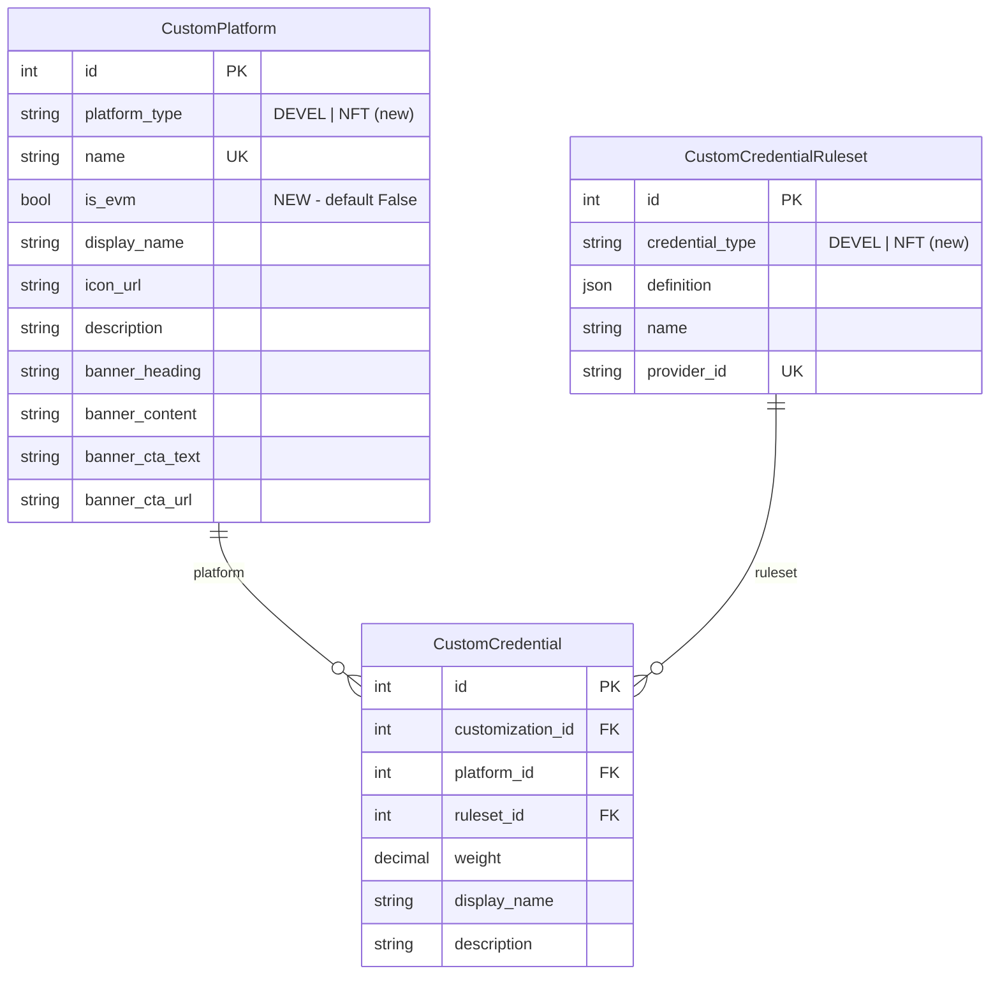

## Enhancement Summary

**Deepened on:** 2026-02-10
**Sections enhanced:** 8
**Review agents used:** Python reviewer, Data migration expert, Security sentinel, Pattern recognition specialist, Code simplicity reviewer, Architecture strategist, Schema drift detector, Deployment verification agent, Performance oracle, Best practices researcher

### Key Improvements from Review

1. **Split migration into 2 files** (schema + choices AlterField, data seed) -- matches existing project pattern (0046/0047, 0048/0049) of separating schema from RunPython
2. **Fixed reverse migration** -- was deleting ALL NFT records; now scoped to exact seeded records only
3. **Fixed existing admin bug** -- `search_display` (invalid) changed to `search_fields`
4. **Added N+1 query fix** -- `select_related('platform', 'ruleset')` on `get_custom_stamps()` and `get_customization_dynamic_weights()` (pre-existing issue, worsened by adding more credentials)
5. **Added `list_filter`** to CustomPlatformAdmin for admin usability
6. **Added 3 new tests** -- mixed platform types, migration idempotency, permissive validation documentation
7. **Added deployment checklist** with pre/post SQL verification queries

### Considered and Deferred

- NFT-specific definition validation (decided: keep generic, IAM validates)
- `clean()` on CustomCredential enforcing platform_type/credential_type match (future iteration)
- `max_length` bump from 5 to 10 on type fields (not needed for "NFT", can do later)
- Credential definition endpoint caching (low urgency, indexed unique field query)

---

# feat: Add Custom NFT Stamp Credential Type

## Overview

Add `NFTHolder` as a new custom credential type alongside the existing `DeveloperList` type. This lets partners award points to users who hold specific NFTs on any EVM chain. The backend stores NFT rule definitions and serves them via the existing API. The IAM service (separate repo) performs the actual on-chain verification.

## Problem Statement / Motivation

Partners want to reward users for on-chain activity, starting with NFT ownership. The existing custom credential system (`CustomPlatform` / `CustomCredentialRuleset` / `CustomCredential`) is generic enough to support this with minimal changes -- we just need a new type and one new field.

## Proposed Solution

Extend the existing custom credential system:

1. Add `NFTHolder` enum value to both `PlatformType` and `CredentialType`
2. Add `is_evm` boolean field to `CustomPlatform` (replaces hardcoded `False`)
3. Fix N+1 queries in `get_custom_stamps()` and `get_customization_dynamic_weights()`
4. Fix existing admin bug (`search_display` -> `search_fields`)
5. Seed one example NFT stamp configuration
6. Add tests

No new models, no API schema changes, no Rust scorer changes.

## Technical Approach

### ERD (Changes Only)



### File Changes

#### 1. `api/account/models.py` -- Model changes

**Add enum values** (lines 740-741 and 787-788):

```python
# CustomPlatform.PlatformType
class PlatformType(models.TextChoices):
    DeveloperList = ("DEVEL", "Developer List")
    NFTHolder = ("NFT", "NFT Holder")  # NEW

# CustomCredentialRuleset.CredentialType
class CredentialType(models.TextChoices):
    DeveloperList = ("DEVEL", "Developer List")
    NFTHolder = ("NFT", "NFT Holder")  # NEW
```

**Add `is_evm` field** to `CustomPlatform` (after line 769):

```python
is_evm = models.BooleanField(
    default=False,
    help_text="Whether this platform supports EVM on-chain verification",
)
```

**Update `get_custom_stamps()`** (line 676):

```python
# Before:
"isEVM": False,  # platform.one_click_flow,

# After:
"isEVM": platform.is_evm,
```

**Fix N+1 query in `get_custom_stamps()`** (line 660):

```python
# Before:
for custom_credential in self.custom_credentials.all():

# After:
for custom_credential in self.custom_credentials.select_related('platform', 'ruleset').all():
```

**Fix N+1 query in `get_customization_dynamic_weights()`** (lines 632, 637):

```python
# Before:
for allow_list in self.allow_lists.all():
    ...
for custom_credential in self.custom_credentials.all():

# After:
for allow_list in self.allow_lists.select_related('address_list').all():
    ...
for custom_credential in self.custom_credentials.select_related('ruleset').all():
```

**Fix N+1 in async version `aget_customization_dynamic_weights()`** (lines 644-656):

```python
# Before (N+1 with explicit aget() calls and "rulesset" typo):
async def aget_customization_dynamic_weights(self) -> dict:
    weights = {}
    async for allow_list in self.allow_lists.all():
        address_list = await AddressList.objects.aget(pk=allow_list.address_list_id)
        weights[f"AllowList#{address_list.name}"] = str(allow_list.weight)

    async for custom_credential in self.custom_credentials.all():
        rulesset = await CustomCredentialRuleset.objects.aget(
            id=custom_credential.ruleset_id
        )
        weights[rulesset.provider_id] = str(custom_credential.weight)

    return weights

# After (select_related eliminates N+1, fixes "rulesset" typo):
async def aget_customization_dynamic_weights(self) -> dict:
    weights = {}
    async for allow_list in self.allow_lists.select_related('address_list').all():
        weights[f"AllowList#{allow_list.address_list.name}"] = str(allow_list.weight)

    async for custom_credential in self.custom_credentials.select_related('ruleset').all():
        weights[custom_credential.ruleset.provider_id] = str(custom_credential.weight)

    return weights
```

**No changes to `validate_custom_stamp_ruleset_definition()`** -- validator stays generic. IAM validates NFT-specific definition structure. The OR logic for `condition.contracts` (user needs token in ANY listed contract) is documented here and verified by IAM.

#### 2. `api/account/admin.py` -- Admin changes

**Update `CustomPlatformAdmin`** (lines 944-947):

```python
@admin.register(CustomPlatform)
class CustomPlatformAdmin(admin.ModelAdmin):
    list_display = ["name", "display_name", "platform_type", "is_evm", "description"]
    search_fields = ["name", "display_name", "description"]  # BUG FIX: was search_display (invalid)
    list_filter = ["platform_type", "is_evm"]  # NEW: filterable now that there are 2+ types
```

No other admin changes needed. The existing `CustomCredentialRulesetAdmin` and `CustomCredentialInline` work for NFT stamps since:
- Ruleset admin already shows `credential_type` in list_display
- Credential inline already supports any platform/ruleset combination

#### 3. Migrations -- Split into 2 files

Following the existing project pattern (0046 schema + 0047 data, 0048 schema + 0049 data):

##### `api/account/migrations/0053_add_custom_platform_is_evm.py` -- Schema (AddField + choices AlterField)

This migration contains the AddField for `is_evm` and the AlterField operations that `makemigrations` auto-generates when the enum choices change. The AlterField is a no-op at the database level (PostgreSQL stores VARCHAR, not DB enum), but required to keep migration state in sync with model definitions. Two schema operations in one migration file is fine -- the Django 4.2 DDL+RunPython concern only applies to separating schema from RunPython, not separating two schema operations. Let `makemigrations` generate this file after making the model changes.

```python
# Schema changes: Add is_evm BooleanField + AlterField for new choices
from django.db import migrations, models

class Migration(migrations.Migration):
    dependencies = [
        ("account", "0052_flatten_embed_stamp_sections"),
    ]

    operations = [
        migrations.AddField(
            model_name="customplatform",
            name="is_evm",
            field=models.BooleanField(
                default=False,
                help_text="Whether this platform supports EVM on-chain verification",
            ),
        ),
        # makemigrations will also generate AlterField operations here
        # for platform_type and credential_type choices changes.
        # These are no-ops at the PostgreSQL level (VARCHAR, not DB enum).
    ]
```

##### `api/account/migrations/0054_seed_nft_holder_example.py` -- Data seed

```python
import json
from hashlib import sha256
from django.db import migrations


EXAMPLE_DEFINITION = {
    "name": "ExampleNFT",
    "condition": {
        "contracts": [
            {
                "address": "0x0000000000000000000000000000000000000000",
                "chainId": 1,
                "standard": "ERC-721",
            }
        ]
    },
}

EXAMPLE_PROVIDER_ID = "NFTHolder#ExampleNFT#{}".format(
    sha256(
        json.dumps(EXAMPLE_DEFINITION, sort_keys=True).encode("utf8")
    ).hexdigest()[0:8]
)


def seed_nft_example(apps, schema_editor):
    CustomPlatform = apps.get_model("account", "CustomPlatform")
    CustomCredentialRuleset = apps.get_model("account", "CustomCredentialRuleset")

    CustomPlatform.objects.get_or_create(
        name="NFTHolder",
        defaults={
            "platform_type": "NFT",
            "is_evm": True,
            "display_name": "NFT Holder",
            "description": "Verify NFT ownership on EVM chains",
            "icon_url": "./assets/nftHolderStampIcon.svg",
        },
    )

    # NOTE: provider_id is computed manually to match CustomCredentialRuleset.save()
    # because RunPython historical models do not call custom save() methods.
    CustomCredentialRuleset.objects.get_or_create(
        provider_id=EXAMPLE_PROVIDER_ID,
        defaults={
            "credential_type": "NFT",
            "definition": EXAMPLE_DEFINITION,
            "name": "ExampleNFT",
        },
    )


def reverse_seed(apps, schema_editor):
    """Delete only the specific seeded records, not all NFT records.

    If CustomCredential records reference these, this will raise
    ProtectedError -- delete those FK records first.
    """
    CustomPlatform = apps.get_model("account", "CustomPlatform")
    CustomCredentialRuleset = apps.get_model("account", "CustomCredentialRuleset")
    # Scoped to exact seeded records -- won't delete admin-created NFT records
    CustomCredentialRuleset.objects.filter(provider_id=EXAMPLE_PROVIDER_ID).delete()
    CustomPlatform.objects.filter(name="NFTHolder").delete()


class Migration(migrations.Migration):
    dependencies = [
        ("account", "0053_add_custom_platform_is_evm"),
    ]

    operations = [
        migrations.RunPython(seed_nft_example, reverse_seed),
    ]
```

#### 4. Test file: `api/account/test/test_custom_nft_stamp.py`

```python
# test_nft_holder_provider_id_generation
# - Create CustomCredentialRuleset with credential_type="NFT" via save()
# - Verify provider_id starts with "NFTHolder#"
# - Verify FULL provider_id matches expected hash (deterministic)

# test_get_custom_stamps_with_nft_platform
# - Create CustomPlatform with platform_type="NFT", is_evm=True
# - Create CustomCredentialRuleset + CustomCredential
# - Call get_custom_stamps()
# - Verify response has platformType="NFT" and isEVM=True

# test_get_custom_stamps_developer_list_is_not_evm
# - Create CustomPlatform with platform_type="DEVEL", is_evm=False
# - Call get_custom_stamps()
# - Verify isEVM=False (backward compatible)

# test_get_custom_stamps_mixed_platform_types
# - Create both an NFT and a DeveloperList credential on the SAME customization
# - Call get_custom_stamps()
# - Verify both appear with correct platformType and isEVM values

# test_dynamic_weights_include_nft_stamp
# - Create NFT CustomCredential with weight=5.0
# - Call get_customization_dynamic_weights()
# - Verify NFTHolder provider_id key present with correct weight

# test_nft_definition_with_multiple_contracts
# - Create ruleset with multiple contracts in condition
# - Verify it saves successfully (no validation error)
# - Verify definition is stored and retrievable

# test_nft_definition_without_contracts_key
# - Create ruleset with {"name": "Foo", "condition": {}} (no contracts key)
# - Verify it saves successfully (validator is intentionally permissive)
# - Documents that NFT-specific validation is deferred to IAM

# test_seed_migration_idempotency
# - Run the seed function twice
# - Verify no duplicates or IntegrityError (get_or_create)
```

### NFT Definition Schema

Stored in `CustomCredentialRuleset.definition` JSONField:

```json
{
  "name": "BoredApes",
  "condition": {
    "contracts": [
      {
        "address": "0xBC4CA0EdA7647A8aB7C2061c2E118A18a936f13D",
        "chainId": 1,
        "standard": "ERC-721"
      }
    ]
  }
}
```

| Field | Type | Description |
|-------|------|-------------|
| `name` | string | Alphanumeric identifier (validated by existing validator) |
| `condition.contracts` | array | One or more contract entries |
| `condition.contracts[].address` | string | Contract address (hex, 0x-prefixed, 42 chars) |
| `condition.contracts[].chainId` | integer | EVM chain ID (positive integer) |
| `condition.contracts[].standard` | string | Token standard (free string, e.g., "ERC-721", "ERC-1155") |

**Semantics**: OR logic -- user satisfies the credential by holding >= 1 token in **any** listed contract. This is documented here and enforced by the IAM service, not the backend.

### Provider ID Format

Auto-generated by `CustomCredentialRuleset.save()`:

```
NFTHolder#{definition.name}#{sha256(definition)[:8]}
```

Example: `NFTHolder#BoredApes#f7e3a1b2`

**Note**: The `save()` method uses `ct.name` (the Python enum member name `NFTHolder`), NOT `ct.value` (the DB value `NFT`) or `ct.label` (the display label `NFT Holder`). If the enum member is ever renamed, existing provider_ids in the database will be orphaned.

## Acceptance Criteria

- [ ] `CustomPlatform.PlatformType` and `CustomCredentialRuleset.CredentialType` enums include `NFTHolder = ("NFT", "NFT Holder")`
- [ ] `CustomPlatform` model has `is_evm` BooleanField (default False)
- [ ] `get_custom_stamps()` returns `isEVM: true` for NFT platforms and `isEVM: false` for developer list platforms
- [ ] `get_custom_stamps()` uses `select_related('platform', 'ruleset')` to avoid N+1 queries
- [ ] `get_customization_dynamic_weights()` uses `select_related` to avoid N+1 queries
- [ ] Admin interface shows `is_evm`, `platform_type`, and `list_filter` for CustomPlatform
- [ ] Admin `search_display` bug fixed to `search_fields`
- [ ] Migration 0053 adds `is_evm` field and updates choices (schema only, auto-generated by `makemigrations`)
- [ ] Migration 0054 seeds one example NFT platform + ruleset (data only)
- [ ] Example seed uses `get_or_create` with `provider_id` as lookup key for idempotency
- [ ] Reverse migration deletes only the specific seeded records (not all NFT records)
- [ ] Provider ID format is `NFTHolder#{name}#{hash}` for NFT rulesets
- [ ] Existing DeveloperList stamps continue working unchanged
- [ ] Tests cover: provider_id generation, get_custom_stamps with NFT, isEVM backward compat, mixed types, dynamic weights, multi-contract definitions, permissive validation, seed idempotency

## Dependencies & Risks

**Dependencies**:
- **Frontend (BLOCKING)**: Must add `"NFT"` entry to `CUSTOM_PLATFORM_TYPE_INFO` registry at `passport/app/config/platformMap.ts:195` before any admin creates `CustomCredential` records linking NFT stamps to a live `Customization`. Without this, the frontend **crashes** on unknown platform types (`throw new Error('Unknown custom platform type: NFT')`). See [Frontend Handoff](#frontend-handoff) below.
- **IAM service** (separate repo): Must implement on-chain verification for `NFTHolder` provider IDs using the `contracts` definition format
- **Embed stamp sections** (separate ticket): NFT stamps need to be added to sections via admin after creation

**Risks**:
- **Frontend crash on unknown type**: The frontend's `usePlatforms` hook at `passport/app/hooks/usePlatforms.tsx:139` throws on unknown `platformType` values. Backend deploy is safe (no new `CustomCredential` records = no `platformType: "NFT"` in API responses). The crash only happens if an admin links an NFT stamp to a `Customization` before the frontend is updated. **Mitigation**: Do NOT create `CustomCredential` records for NFT stamps until frontend deploys.
- **Rust scorer**: Does not merge customization dynamic weights (existing limitation). NFT stamp weights are ignored in the Rust scoring path. Production currently routes 0% to Rust, so no immediate impact. **Track as tech debt**: must be resolved before Rust traffic % > 0 for customizations with custom credentials.
- **Admin errors**: No NFT-specific validation on the definition JSON. Malformed contract addresses or chain IDs would only surface when IAM attempts verification. Acceptable for admin-configured data.
- **Reverse migration + PROTECT FK**: If an admin creates `CustomCredential` records referencing the seeded NFT platform/ruleset before a rollback, the reverse migration will fail with `ProtectedError`. Delete those `CustomCredential` records first before reversing.

## Deployment Checklist

### Pre-Deploy (Read-Only Verification)

```sql
-- Baseline counts (save these)
SELECT platform_type, COUNT(*) FROM account_customplatform GROUP BY platform_type;
SELECT credential_type, COUNT(*) FROM account_customcredentialruleset GROUP BY credential_type;
SELECT COUNT(*) FROM account_customcredential;

-- Verify is_evm column does not exist yet
SELECT column_name FROM information_schema.columns
WHERE table_name = 'account_customplatform' AND column_name = 'is_evm';

-- Verify no NFT data exists yet
SELECT * FROM account_customplatform WHERE name = 'NFTHolder';
SELECT * FROM account_customcredentialruleset WHERE credential_type = 'NFT';
```

### Deploy Steps

1. Deploy code + run migrations (`migrate account 0054`)
2. Migration 0053: AddField is instant (BooleanField with default, tiny table) + AlterField is a no-op (choices are Python-level)
3. Migration 0054: RunPython seeds 2 rows

**Zero-downtime**: YES. `ALTER TABLE` on small table is milliseconds. Seed data is not linked to any customization so it's invisible to API consumers.

### Post-Deploy Verification (Within 5 Minutes)

```sql
-- Verify is_evm added correctly
SELECT name, platform_type, is_evm FROM account_customplatform ORDER BY id;
-- Expected: existing DEVEL rows have is_evm=False, new NFTHolder row has is_evm=True

-- Verify seed data
SELECT provider_id, credential_type, name
FROM account_customcredentialruleset WHERE credential_type = 'NFT';
-- Expected: one row starting with NFTHolder#ExampleNFT#

-- Verify existing data unchanged
SELECT COUNT(*) FROM account_customcredential;
-- Expected: same count as pre-deploy
```

### Rollback

1. Redeploy previous code (immediate -- old code hardcodes `isEVM: False`, ignores new column)
2. If needed, reverse migration: `migrate account 0052` (deletes seeded data, drops column)
3. If `CustomCredential` records reference NFT objects, delete those FK records first

## Multiple NFT Platforms Per Customization

The data model already supports partners having multiple distinct NFT platforms, each with their own icon, banner, and credentials. No changes needed -- just create separate `CustomPlatform` rows in admin:

| name | platform_type | icon_url | display_name |
|------|---------------|----------|--------------|
| `"CoolCatsNFT"` | `"NFT"` | `coolcats.svg` | `"Cool Cats"` |
| `"BAYCCollection"` | `"NFT"` | `bayc.svg` | `"Bored Apes"` |

The frontend handles this natively: each platform entry gets a unique `Custom#{name}` ID in `usePlatforms.tsx:94` and renders independently. Multiple platforms of the same `platformType` are fully supported on both backend and frontend.

---

## Frontend Handoff

**When backend work is complete, hand this to the frontend team:**

### What's Changing

The `passport-scorer` backend is adding a new custom credential type `"NFT"` for NFT ownership verification. The API response from `GET /account/customization/{path}/` will include `customStamps` entries with `platformType: "NFT"` once admins configure them.

### What Frontend Needs To Do

**1. Add `"NFT"` to `CUSTOM_PLATFORM_TYPE_INFO` registry** (`app/config/platformMap.ts:195`)

Currently only `"DEVEL"` is registered. Without this, the app crashes on line 139 of `usePlatforms.tsx`:
```
throw new Error('Unknown custom platform type: NFT')
```

Add an entry like:
```typescript
export const CUSTOM_PLATFORM_TYPE_INFO: { [id: string]: CustomPlatformTypeInfo } = {
  DEVEL: { ... },  // existing
  NFT: {
    basePlatformName: "???",         // needs an NFT base platform
    platformClass: ???.NFTPlatform,   // needs NFT platform class
    platformParams: {},               // NFT needs no OAuth params
  },
};
```

**2. Create an NFT platform class** (or reuse an existing EVM platform)

The platform class needs to handle on-chain verification flow:
- Connect wallet (user proves address ownership)
- IAM service checks `balanceOf` against contracts in the credential definition
- No OAuth flow needed (unlike DEVEL which uses GitHub OAuth)

**3. The `isEVM` field** in the API response is now dynamic (was hardcoded `false`). For NFT stamps it will be `true`. The frontend already reads `isEVM` from base platform definitions, so this should align automatically once the base platform is set up correctly.

### API Response Shape (Unchanged)

The `customStamps` response structure is identical to existing DEVEL stamps:
```json
{
  "customStamps": {
    "myNFTPlatform": {
      "platformType": "NFT",
      "iconUrl": "./assets/nft-icon.svg",
      "displayName": "NFT Collection",
      "description": "Verify NFT ownership",
      "banner": { "heading": "...", "content": "...", "cta": { ... } },
      "isEVM": true,
      "credentials": [
        {
          "providerId": "NFTHolder#BoredApes#f7e3a1b2",
          "displayName": "Bored Ape Yacht Club",
          "description": "Holders of BAYC NFTs"
        }
      ]
    }
  }
}
```

### NFT Definition Schema (for IAM integration)

The credential definition (fetched via `GET /account/customization/credential/{provider_id}`) contains:
```json
{
  "ruleset": {
    "name": "BoredApes",
    "condition": {
      "contracts": [
        { "address": "0xBC4CA0...", "chainId": 1, "standard": "ERC-721" }
      ]
    }
  }
}
```
- `contracts` is an array (OR logic -- any one satisfies the credential)
- `standard` is a free string (e.g., `"ERC-721"`, `"ERC-1155"`)
- Verification: user holds >= 1 token in any listed contract

### Deployment Coordination

1. **Backend deploys first** (safe -- no NFT stamps linked to any customization yet)
2. **Frontend deploys `CUSTOM_PLATFORM_TYPE_INFO` update** (safe -- no NFT data flowing yet)
3. **Admin creates NFT stamps and links to customizations** (now safe -- both sides ready)

### Key Files to Touch

- `app/config/platformMap.ts:195` -- Add `"NFT"` to `CUSTOM_PLATFORM_TYPE_INFO`
- `platforms/` -- New NFT platform class (or adapt existing EVM platform)
- `app/hooks/usePlatforms.tsx` -- No changes needed (already generic)

---

## What's NOT in This Ticket

- IAM on-chain verification logic (separate repo)
- Frontend UI for NFT stamps (separate repo)
- Embed stamp sections integration (separate ticket)
- Token ID filtering, minimum balance, trait checks (future enhancement)
- Rust scorer customization weight merging (separate concern, tracked as tech debt)
- Backend validation of NFT definition specifics (IAM's responsibility)
- `clean()` validation on CustomCredential enforcing platform/credential type match (future iteration)

## References & Research

### Internal References

- Brainstorm: `docs/brainstorms/2026-02-10-custom-nft-stamp-brainstorm.md`
- CustomPlatform model: `api/account/models.py:739-772`
- CustomCredentialRuleset model: `api/account/models.py:786-821`
- CustomCredential model: `api/account/models.py:824-837`
- Definition validator: `api/account/models.py:775-783`
- `get_custom_stamps()`: `api/account/models.py:658-687`
- `get_customization_dynamic_weights()`: `api/account/models.py:630-656`
- Hardcoded isEVM: `api/account/models.py:676`
- CustomPlatformAdmin (search_display bug): `api/account/admin.py:944-947`
- CustomCredentialRulesetAdmin: `api/account/admin.py:950-960`
- Migration pattern (schema): `api/account/migrations/0046_add_topnav_dashboard_fields.py`
- Migration pattern (data seed): `api/account/migrations/0047_populate_topnav_dashboards.py`
- Migration pattern (seed by exact ID): `api/account/migrations/0049_populate_featured_campaigns.py`
- Scoring weight merge: `api/scorer_weighted/computation.py:39-43`
- Rust scorer credential definition handler: `rust-scorer/src/api/handlers/internal.rs:199-211`

### Frontend References (passport repo)

- Custom platform type registry: `passport/app/config/platformMap.ts:195` (`CUSTOM_PLATFORM_TYPE_INFO`)
- Custom stamps consumption: `passport/app/hooks/usePlatforms.tsx:100-167`
- Platform ID generation: `passport/app/hooks/usePlatforms.tsx:94` (`customPlatformNameToId`)
- Unknown type crash: `passport/app/hooks/usePlatforms.tsx:139` (`throw new Error`)
- Custom category grouping: `passport/app/hooks/usePlatforms.tsx:216-228`
- Test coverage: `passport/app/hooks/usePlatforms.test.ts:52-67`

### Review Findings (Key Insights)

- **N+1 queries**: `get_custom_stamps()` and `get_customization_dynamic_weights()` produce 2N+1 queries per call (N = number of custom credentials). `select_related` reduces to 1 query with JOINs. Pre-existing issue, worsened by adding more credentials.
- **Django 4.2 choices migration**: Adding enum values to `TextChoices` triggers `makemigrations` to generate an `AlterField` migration. This is a no-op in PostgreSQL but required to keep migration state in sync. The AlterField is combined with the AddField in migration 0053 since two schema operations can safely coexist in one migration file.
- **RunPython + save()**: Historical models from `apps.get_model()` lack custom `save()` methods. The seed must manually compute `provider_id` using the same hash logic. This is frozen in migration history and safe even if `save()` changes later.
- **Reverse migration safety**: Original reverse deleted all NFT records (dangerous if admins created real NFT stamps). Fixed to delete only the specific seeded records by `provider_id` and `name`.
- **Security (pre-existing)**: The `/account/customization/credential/{provider_id}` endpoint is public (no auth). Provider IDs are partially predictable (known prefix + 32-bit hash). This is acceptable since the data is configuration metadata. The Rust handler has a URL double-decoding issue (`%23` replacement + `urlencoding::decode`) that should be fixed separately.
